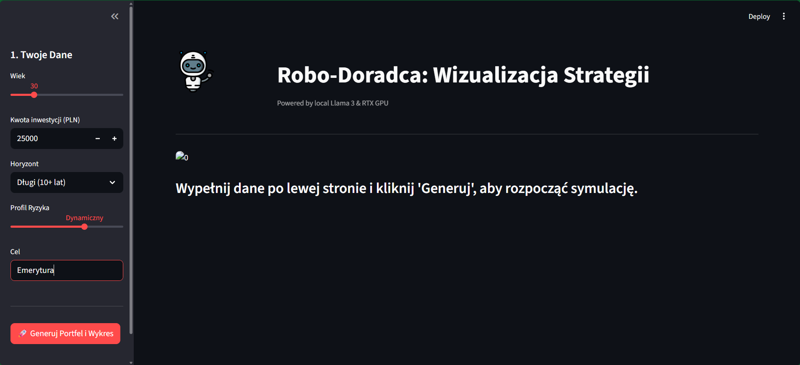
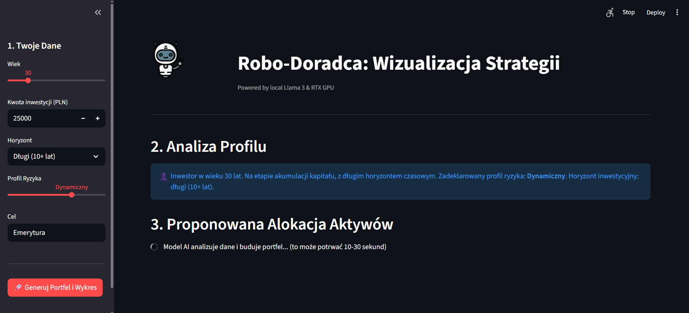
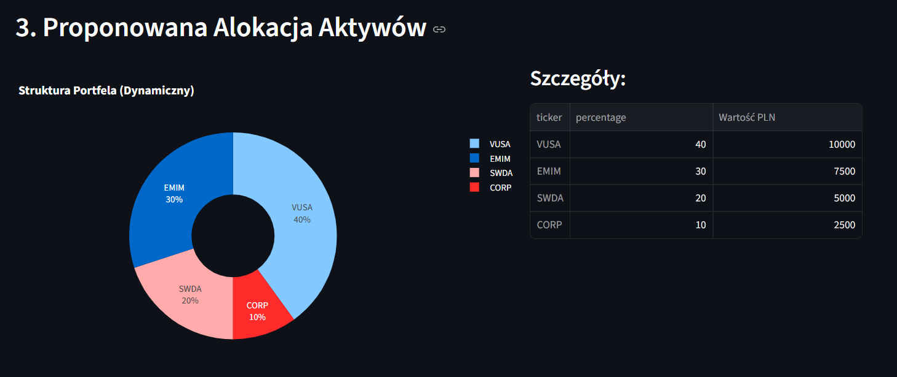
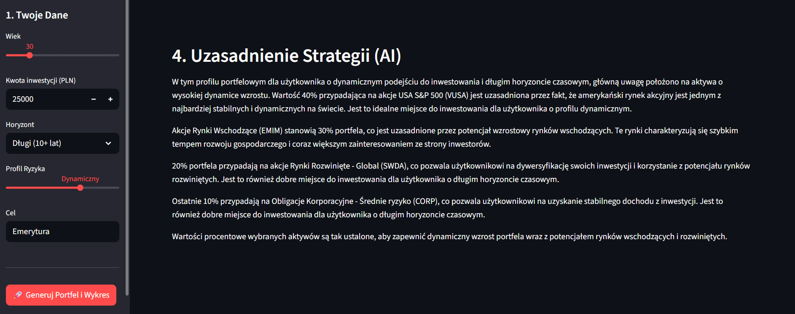

# Robo-Doradca Inwestycyjny AI (PoC)

Projekt zaliczeniowy z przedmiotu: Zastosowania Sztucznej Inteligencji.
Aplikacja wykorzystuje lokalny model LLM (Llama 3.1) do generowania strategii inwestycyjnych opartych o fundusze ETF.

## 1. Architektura Rozwiązania

Aplikacja działa w oparciu o architekturę RAG-like (Retrieval-Augmented Generation) z wykorzystaniem predefiniowanego kontekstu finansowego.

* **Silnik AI:** Ollama (lokalna instancja)
* **Model:** Llama 3.1 8B Instruct
* **Interfejs:** Python + Streamlit
* **Wizualizacja:** Plotly Express
* **Sprzęt testowy:** NVIDIA RTX 5060 (Inference na GPU)

## 2. Funkcjonalności

1.  **Analiza Profilu:** Określenie profilu ryzyka na podstawie ankiety (MIFID light).
2.  **Asset Allocation:** Generowanie portfela ETF w formacie JSON.
3.  **Wizualizacja:** Automatyczne tworzenie wykresów kołowych (Donut Chart) struktury portfela.
4.  **Uzasadnienie:** Tekstowe wyjaśnienie strategii generowane przez LLM w jęz. polskim.

## 3. Instrukcja Uruchomienia

### Wymagania wstępne
* Zainstalowany [Ollama](https://ollama.com/)
* Pobrany model: `ollama run llama3.1`
* Python 3.10+

### Instalacja
1. Sklonuj repozytorium.
2. Zainstaluj zależności:
   ```bash
   pip install -r requirements.txt
   
## 4. Przykłady Działania 

1. Landing Page

2. Procesowanie ankiety (wyslanie zapytania do LLM)

3. Alokacja aktywów - wykres

4. Alokacja aktywów - uzasadnienie


